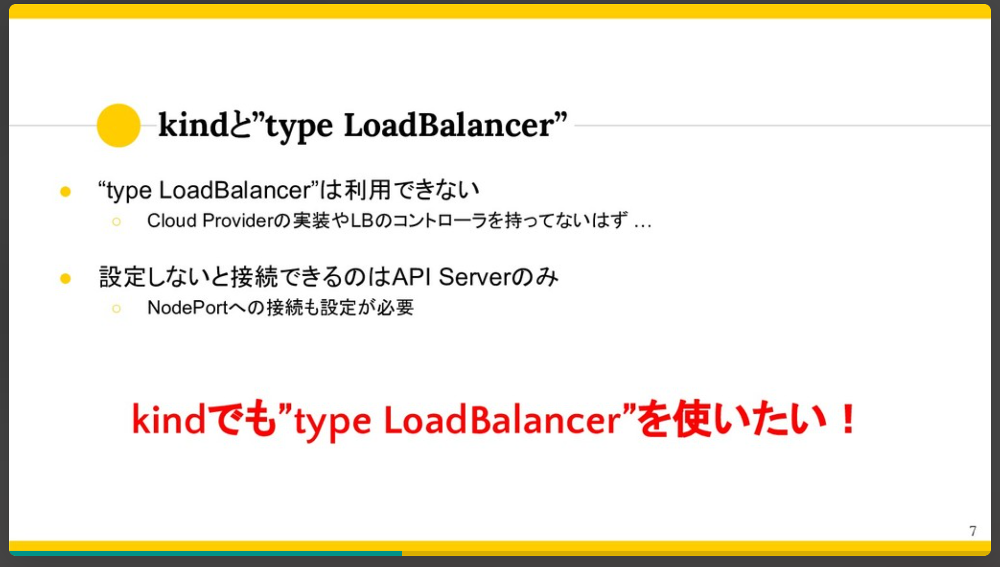

# external-traffic-policy

## 概要

- NodePort Service
- LoadBalancer Service
では、ノード上に到達したリクエストが、さらに他のノードのPodに対してロードバランシングされるようになっています。

> !(NodePort Serviceで多重にロードバランシングされてしまう)[https://thinkit.co.jp/sites/default/files/article_node/1373811.jpg]
> 
> 引用元: [KubernetesのDiscovery＆LBリソース（その1）](https://thinkit.co.jp/article/13738?page=0%2C1)

この二段階ロードバランシングによって、
- 不要なオーバーヘッドが生じてしまう
- Nodeでロードバランシングされる際NATされるため、送信元IPが消失してしまう
- ノード1台に1Podを配置するDaemonSetでは、リクエストを送る際にPodを特定できなくなってしまう

などの問題があります。

この問題の回避策として、ノードによるロードバランシングを無効化する`spec.externalTrafficPolicy`オプションがあります。

```
spec:
  type: LoadBalancer
  externalTrafficPolicy: Local #ノードによるロードバランシングが無効化される
  ports:
    - name: "http-port"
      protocol: "TCP"
      port: 8080
      targetPort: 80
      nodePort: 30080
  selector:
    app: sample-app
```

## NodePort ServiceにおけるExternalTrafficPolicy

kindではNodePortを利用したノードへのアクセスが出来ず、ハンズオンを用意出来なかった。。。
- デフォルトのNodePortでは接続先ノードを指定しても、Podを特定出来ない
- `spec.externalTrafficPolicy`を有効化することで接続先ノードに載っているPodにのみ疎通できるようになる
ことを確認したかった。

## LoadBalancer ServiceにおけるExternalTrafficPolicy

kindではLoadBalancerにおいて`spec.externalTrafficPolicy: Local`が利用できなかった。

> 
> 引用元: [kindでも"type LoadBalancer"を使いたい!](https://speakerdeck.com/uesyn/kubernetes-meetup-tokyo-24-kind-with-type-loadbalancer)

## 最後に

リソースを削除しておきましょう。
```
kubectl delete namespace handson
```